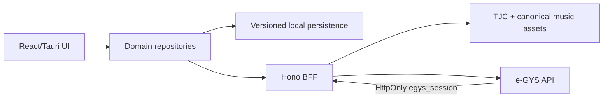
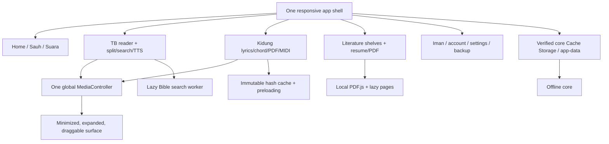
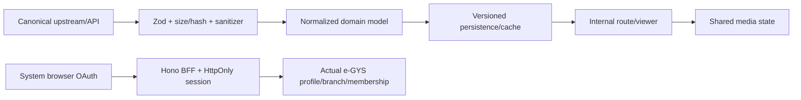
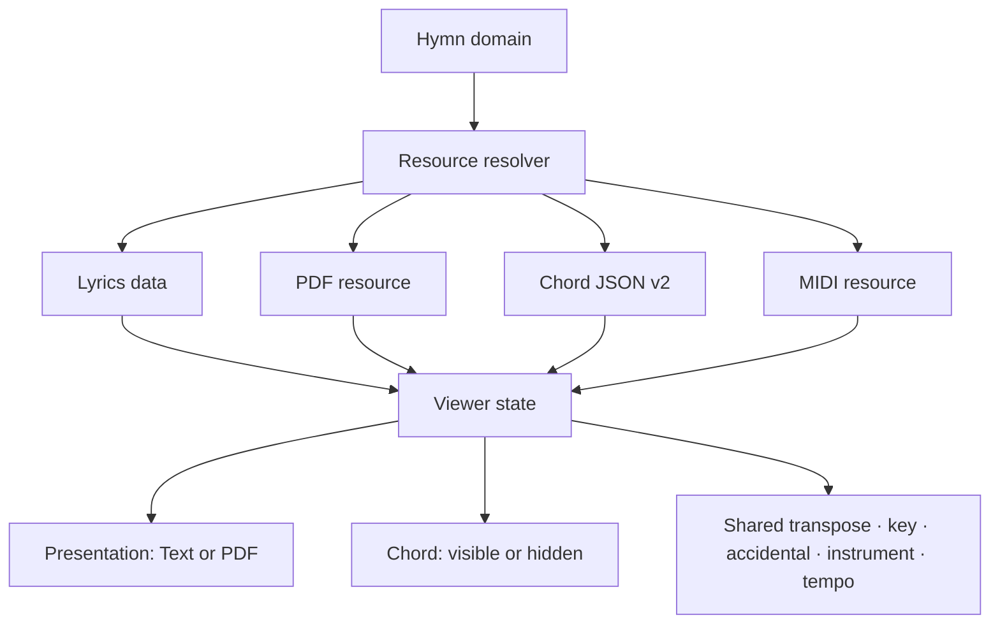
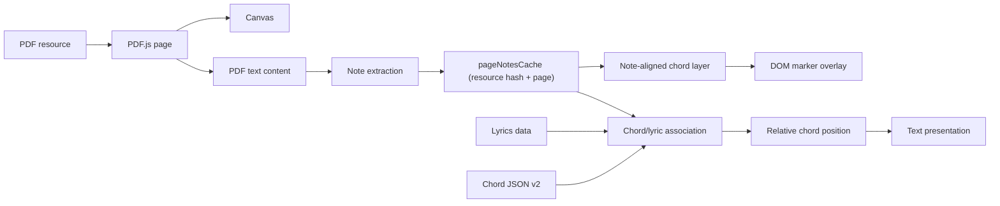
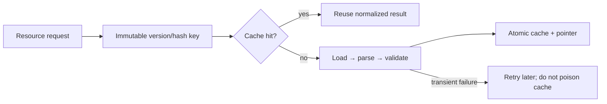
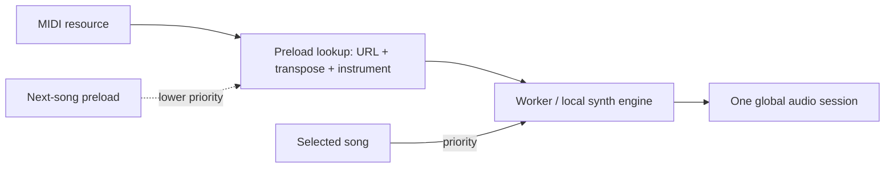
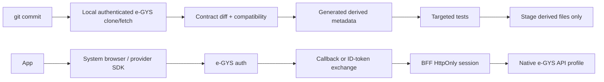

# GYSApp-Tauri

Clean-room, offline-first companion for GYS hymn, Bible, chord, MIDI, and
faith content. The project is a public MIT pnpm monorepo with a React web/PWA,
Hono BFF, and Tauri native shell.

## Status

The rewrite starts from an empty history. Functional discovery is sourced from
`ThenGB/GYSAPP-Fork@4f0d39b`; canonical music and assets are sourced from
`gyspnk/gyschordweb@cbc7d386`. Both upstreams are read-only. Discovery evidence,
provenance, and architectural decisions live in [`docs/`](./docs).

The current Preview/Beta implementation provides typed contracts, a testable
domain boundary, the Quiet Sanctuary web shell, a secure BFF boundary, local
TB Bible/hymn/faith readers, a lazy PDF reader backed by the GYSApp-Fork
hymnal database, canonical GYSChordWeb chord/MIDI assets, real TJC literature
and Suara Sejati feeds, today's Sauh Bagi Jiwa, encrypted backup/import, and a
native e-GYS session/profile adapter. Literature keeps a persistent “Terakhir
dilihat” shelf with version-aware page resume, while the local PDF.js reader
uses an allowlisted BFF range proxy when deployed. Kidung prefetches only the
next/previous binary music assets and never eagerly downloads heavy PDFs.
The TB reader runs its 31,172-verse search index in a lazy worker with a
bounded startup fallback, and the global player keeps a compact minimized
context link back to the active verse or hymn.
Upstream-backed features keep checked-in, integrity-verified snapshots and a
generated asset manifest so the app remains useful offline and can revalidate
without downloading unchanged assets.

## Architecture at a glance



The UI never imports raw upstream source. `packages/contracts` validates every
boundary, `packages/domain` owns reusable reader/cache/media behavior, the BFF
handles origin/security/cookie concerns, and `scripts/sync-egys.mjs` produces
only reviewed derived contract metadata from an ignored local e-GYS checkout.
The e-GYS login boundary uses the provider's official browser/native SDK; after
the ID-token exchange, profile and membership data are API-driven rather than
rendered through a WebView.

## Feature map





The detailed Literature, Kidung, Bible, persistent-media, e-GYS, cache, and
packaged-asset diagrams live in [`docs/architecture.md`](./docs/architecture.md).

### Kidung viewer contract

Kidung has one `Hymn` entity and two presentation modes. Chord is a shared
capability, so the same verified note-aligned v2 source can be shown in Text or
as a DOM overlay above the PDF canvas. A mode switch preserves transpose, key,
accidental, MIDI, and the global media session.











## Development

```bash
corepack enable
pnpm install
pnpm test
pnpm typecheck
pnpm build
pnpm verify:docs
pnpm dev
```

`pnpm install` enables the repository-managed `.githooks` path. Before a
commit, the hook checks the private e-GYS remote revision locally, rebuilds the
reviewable route contract when it changes, blocks breaking route removals, and
runs targeted contract/domain tests. Before a push it repeats the upstream
check and runs the full local quality gate. Use `pnpm sync:egys` to refresh the
lock deliberately; credentials are taken from the developer's existing Git
credential manager/SSH setup and are never written to the repository. See
[`docs/egys-integration.md`](./docs/egys-integration.md) for the contract and
hook flow.

## Documentation map

- [`docs/architecture.md`](./docs/architecture.md) — module boundaries,
  persistence, asset lifecycle, Mermaid diagrams, and release gates.
- [`docs/egys-integration.md`](./docs/egys-integration.md) — verified e-GYS
  auth contract, browser/native authentication boundary, API profile mapping,
  synchronization, and sequence diagrams.
- [`docs/discovery/`](./docs/discovery/) — source provenance, generated locks,
  contract snapshots, and discovery evidence.
- [`docs/release-readiness.md`](./docs/release-readiness.md) — Preview/Beta/GA
  evidence ledger and protected deployment prerequisites.
- [`PROGRESS.md`](./PROGRESS.md) — honest implementation and verification
  status.
- [`CHANGELOG.md`](./CHANGELOG.md) — user-visible changes in the current
  hardening slice.

Node 24 and pnpm 11 are used in CI. PDF.js, fonts, and application code are
bundled locally; Google/Apple sign-in SDKs are loaded only after the user
chooses a provider and are never required for browsing. e-GYS and BFF
credentials remain deployment secrets.

## Delivery and performance

The web app is configured for a GitHub Pages project deployment at
`/GYSApp-Tauri/`. The Pages workflow builds every workspace package, verifies
generated provenance, runs the bundle budget, and publishes the static PWA.
The current production baseline is approximately 82.8 KiB gzip for the main
application chunk and 159.1 KiB gzip for all initial JavaScript; PDF.js, its
worker, and the TB search worker stay lazy-loaded, while the FluidSynth worker
and TimGM pack are same-origin on-demand/PWA assets. Use `pnpm verify:bundle` to
check the budget locally.

The shell uses one responsive navigation surface across desktop, rail, and
mobile breakpoints. Offline TB/hymn/faith packs remain local, while larger
Bible database, PDF, MIDI, and chord assets are loaded on demand, verified by
size/hash, and cached by source version to keep first install and first paint
predictable.

The PWA service worker follows the same budget: the v8 core cache installs only
the shell and small verified offline indexes. TimGM/FluidSynth and the MIDI
worker are warmed in the background after the shell is ready (and skipped on
Save-Data/2G connections), so activation never blocks the first usable frame.

## Deployment prerequisites

Pushes to `main` and `codex/**` trigger GitHub Pages. Configure the repository's
Pages source as **GitHub Actions**. The optional Worker workflow needs
`CLOUDFLARE_API_TOKEN` and `CLOUDFLARE_ACCOUNT_ID`; set `EGYS_API_BASE_URL` and
`EGYS_UPSTREAM_COMMIT` as protected Worker variables/secrets when the e-GYS
backend is ready. The private e-GYS repository is intentionally never cloned
or fetched by GitHub Actions: authenticated maintainers run the repository-
managed local pre-commit/pre-push hooks, which refresh the ignored checkout and
stage only derived contract metadata. Without the protected deployment values, the web build still works
and shows an honest unavailable-session state instead of fabricating account
data.

## License

MIT. Upstream provenance and asset licensing notes are documented in
[`docs/discovery/asset-inventory.md`](./docs/discovery/asset-inventory.md).
