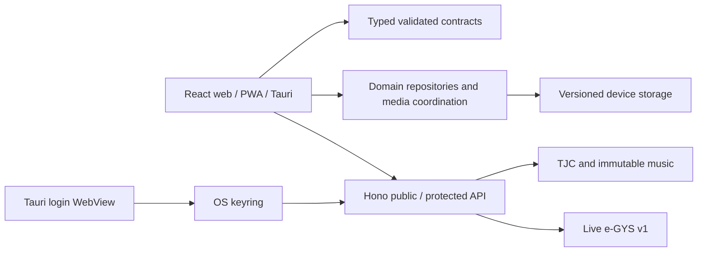
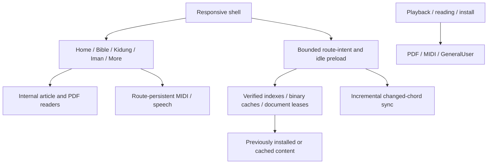

# GYSApp-Tauri

An offline-first Gereja Yesus Sejati companion for Alkitab, Kidung, Dasar
Kepercayaan, literature, Sauh Bagi Jiwa and Suara Sejati. One React application
runs as a web/PWA and inside the Tauri shell, with a Hono Worker for public
content and protected e-GYS integration.

**Documentation reviewed: 2026-10-07.** Current delivery remains Preview/Beta.
Local browser checks are evidence of the named behavior, not a claim of signed
native releases, successful production authentication or guaranteed instant
network loading. Historical audits retain their original dates and results.

## Current application

| Surface            | Implemented behavior                                                                                                                                                                            |
| ------------------ | ----------------------------------------------------------------------------------------------------------------------------------------------------------------------------------------------- |
| Beranda            | Cached devotional/catalog content first, reserved thumbnail geometry, decoded-image fade, responsive continue-reading and article links.                                                        |
| Alkitab            | Bundled TB reader, lazy search worker, split reading, annotations, voice playback, justified verses and smooth reader zoom. Book/chapter/verse drafts use a mobile keypad and explicit opening. |
| Kidung             | 533 source-backed entries, shared category/playlist/settings/mode controls, separate text and score modes, responsive lyrics, optional canonical chords and persistent MIDI.                    |
| Iman               | Full text of all ten beliefs in ID/EN/ZH, full-width search and justified reading, compact note/PDF actions, ten locally served official Indonesian PDF booklets.                               |
| Literatur          | 300-entry packaged catalog, favorites/history/resume, internal articles and PDF.js reader, validated source discovery and range loading through the public content Worker.                      |
| Sauh / Suara       | Trusted publisher content, cached first paint, sanitized internal articles, adaptive columns and readable dark themes.                                                                          |
| Settings / account | Adaptive collapsible settings, ID/EN/ZH, theme transitions, data/backup tools and a single Google/WhatsApp/Apple provider row.                                                                  |

The default accent is Church blue. Desktop navigation uses a fixed sidebar/rail;
mobile uses bottom navigation. Route, theme, menu, chord and media transitions
honor reduced motion. The header displays a detected account photo and does
not add online/offline status clutter.

MIDI transport, seek, instrument, key and transpose remain available while
expanded. Utilities occupy one menu. The player uses two rows on tablet/desktop
and three on phones, with 36 px mouse or 40 px touch controls. Minimize leaves
a 28 px visible half-circle at either screen edge inside a 44 × 60 px hit area.
Tap restores; drag or arrow keys move it; playback and settings survive routes.
TTS retains its own source-aware dock and coordinates audio ownership with MIDI.

All internal PDF viewers share maximal initial fit, centered pages, Ctrl+wheel
and pinch zoom, mouse/touch panning, compact controls, saved reading locations
and sharp visible-region detail rendering. Zoom is 100–800% of the fitted page.
Two-page hymns keep both page and previous/next-song navigation.

## Architecture


```mermaid
flowchart LR
  UI[React web / PWA / Tauri] --> CONTRACTS[Typed validated contracts]
  UI --> DOMAIN[Domain repositories and media coordination]
  DOMAIN --> LOCAL[Versioned device storage]
  UI --> BFF[Hono public / protected API]
  BFF --> CONTENT[TJC and immutable music]
  BFF --> EGYS[Live e-GYS v1]
  NATIVE[Tauri login WebView] --> KEYRING[OS keyring] --> BFF
```


```mermaid
flowchart TB
  SHELL[Responsive shell] --> ROUTES[Home / Bible / Kidung / Iman / More]
  ROUTES --> READERS[Internal article and PDF readers]
  ROUTES --> PLAYER[Route-persistent MIDI / speech]
  SHELL --> WARM[Bounded route-intent and idle preload]
  WARM --> CACHE[Verified indexes / binary caches / document leases]
  CACHE --> OFFLINE[Previously installed or cached content]
  USER[Playback / reading / install] --> OPTIONAL[PDF / MIDI / GeneralUser]
  WARM --> CHORDS[Incremental changed-chord sync]
```

`packages/contracts` defines schema/URL/provenance boundaries;
`packages/domain` owns platform-independent cache, reader and audio behavior.
`apps/web/src` owns route UI and browser adapters. `apps/bff` handles origin,
cookie, validation, streaming and upstream concerns. `apps/native/src-tauri`
provides narrow storage, keyring, lifecycle and login commands.

### Account boundary

Web/PWA authenticates through the BFF directly. Google's dynamic Identity
Services button is inline in the account row, using an icon on compact screens;
Apple uses its official popup SDK and validates authorization state.
WhatsApp reserves a messaging tab on the provider click, opens the prepared
send link and tracks the official internal reference through a BFF WebSocket
relay. There is no OTP entry or login overlay. A trailing 120-second countdown
expires automatically; clicking WhatsApp again starts a new attempt. Confirmation
uses the sender phone from the socket event, not the bot phone from the challenge.
The opaque login token stays in an HttpOnly cookie; profile refresh detects the
member. Provider authorization may use its own external window.

Tauri uses the origin-allowlisted official v1 login WebView and stores the bridge
token in the OS keyring. The generated e-GYS v2 contract remains discovery-only.
See [the account guide](docs/egys-integration.md) for endpoints, deployment and
real-account acceptance requirements.

### Content and cache

The reviewed canonical music source is
`gyspnk/gyschordweb@e8e7efe1189b5746a2bb542348e221844091c8d1`:
533 PDFs, 533 MIDI files, 161 chord documents and two SoundFonts, totaling 1,229
locked entries. The chord geometry audit maps all 3,738 entries without orphan
or invalid positions. The functional Fork source remains
`ThenGB/GYSAPP-Fork@4f0d39b`; its KR master/map is distinct from canonical scores.
Runtime code does not import either upstream checkout.

The application ships TimGM6mb (5,994,284 bytes) and the local FluidSynth runtime.
GeneralUser-GS (32,319,396 bytes) is an optional integrity-checked download.
Startup does not synthesize MIDI or download neighboring audio while MIDI is off.
Every launch schedules a chord-manifest check after first paint; unchanged
verified entries avoid payload reads and downloads. Changed or missing content
uses bounded synchronization and atomic pointers.

Service-worker shell generation v25 prepares verified application assets and
compact indexes. Editorial snapshots paint from disk and refresh in the
background. TimGM/runtime warming follows shell readiness; MIDI/PDF assets load
on demand and chord sync retrieves only missing/changed payloads.
Save-Data/slow connections restrict optional warm-up.
Offline availability depends on successful installation/cache retention;
protected account responses are excluded from public caches.

## Development and verification

Requires Node ≥24 and pnpm 11.21.0. Dependency versions are locked in
`pnpm-lock.yaml` and package manifests.

```sh
corepack enable
pnpm install --frozen-lockfile
pnpm build
pnpm typecheck
pnpm test
pnpm verify:generated
pnpm verify:docs
pnpm verify:bundle
pnpm dev
```

Use `pnpm build:test-deps` before a fresh unit-test/watch run. `pnpm dev` serves
Vite on 5173; `pnpm preview` serves the built application on 4173. Do not rebuild
`dist` underneath an active browser run.

```sh
GYS_E2E_PREBUILT=1 pnpm test:e2e bible-picker-mobile.spec.ts midi-edge.spec.ts midi-player-design.spec.ts --fully-parallel --workers=2 --retries=0
pnpm test:e2e:changed
pnpm test:performance
pnpm verify:native-assets
```

Browser mode uses production assets. `pnpm test:e2e:dev` is the local HMR
alternative; it is rejected in CI or with `GYS_E2E_PREBUILT=1`. Selective tests
use conservative dependency routing; shared unknown changes select the full
suite. Full browser, native and signed-device gates remain separate from quick
iteration. See [testing and maintenance](docs/testing-and-maintenance.md).

Repository hooks check staged formatting at commit and deterministic formatting,
documentation, provenance, types and unit tests at push. Neither hook silently
syncs the private e-GYS repository. `pnpm verify:release` is the explicit full
release gate, including authenticated local source checks and native/browser
verification. Never stage ignored `.tmp-egys-*` checkouts or credentials.

## Deployment

A push to `main` triggers CI and GitHub Pages at `/GYSApp-Tauri/`. Backend or
contract changes also trigger the Worker workflow. Pages and Worker are separate
artifacts: a successful push is not a successful deployment receipt.

- Pages: set the source to **GitHub Actions**. `VITE_BFF_BASE_URL` selects the
  deployed BFF for account/public APIs. Official literature PDFs also have a
  public Worker fallback when this optional build variable is absent.
- Worker: configure protected `CLOUDFLARE_API_TOKEN` and
  `CLOUDFLARE_ACCOUNT_ID`. Without them the workflow explicitly skips deployment.
  `EGYS_API_BASE_URL` must resolve to live `https://e.gys.or.id`.
- Worker origins must include the actual Pages/dev/native origin. Literature
  PDF streaming must allow trusted TJC and `tjcorguploads.s3.amazonaws.com` URLs
  and expose range response headers.
- `VITE_ASSET_MANIFEST_URL` optionally points to an independent HTTPS offline
  manifest. Leave it unset for the bundled integrity-checked manifest.
- Windows installer packaging is manual. Signing uses protected PFX secrets;
  Android/iOS toolchains, signing, native account and device acceptance are
  required before claiming a release on those platforms.

Manual preview delivery uses **Native Windows installer** and **Native Android
APK** in Actions. Set `ref` to the exact reviewed commit and `release_tag` to an
existing draft release to attach the packages. Android produces an ARM64
debug-signed preview APK; Windows defaults to an unsigned x64 NSIS installer.
These workflows do not run on ordinary pushes. Protected production signing
and real-device acceptance remain separate from preview artifact builds.

[Deployment and troubleshooting](docs/operations.md) describes variables,
provider/PDF failures, caches and post-push checks.

## Documentation

Start at [the documentation index](docs/README.md). It separates current guides
from historical plans and dated receipts.

- [User guide](docs/user-guide.md): reader, account, zoom, player and offline flows.
- [Architecture](docs/architecture.md): modules, lifecycles and Mermaid diagrams.
- [Cache and preload reference](docs/cache-and-preload.md): identities, bounds and recovery.
- [UI and motion](docs/ui-system.md): layout, sizing, interaction and accessibility.
- [Testing and maintenance](docs/testing-and-maintenance.md): commands, evidence and hooks.
- [Feature status](docs/discovery/feature-parity-matrix.md): current implementation and open gates.
- [Release readiness](docs/release-readiness.md): current checks and dated historical evidence.
- [Changelog](CHANGELOG.md): current user-facing changes.

## License

MIT for this repository's application code. Publisher content, fonts,
SoundFonts and FluidSynth retain their individual attribution/licenses;
see [asset inventory](docs/discovery/asset-inventory.md) and bundled notices.
