# GYSApp architecture

The application is a clean-room pnpm monorepo. Runtime code depends on
contracts and domain ports rather than on an upstream repository checkout.

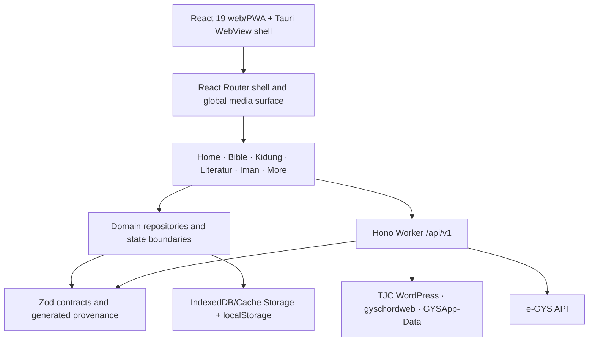

Online devotional content follows the same shell and cache boundary as
offline readers. Home selects the current Sauh record once; the route-level
Sauh and Suara screens reuse that record instead of opening duplicate tabs.
When a Suara item is selected, only the allowlisted TJC article endpoint is
fetched through the BFF. The worker strips executable/embedded markup, limits
the body, validates `OnlineArticle`, and returns a reader document. The source
link remains available as an explicit secondary action. A Pages preview with
no `VITE_BFF_BASE_URL` uses the same allowlisted WordPress post feed and client
sanitizer as a compatibility fallback; it never injects upstream HTML.

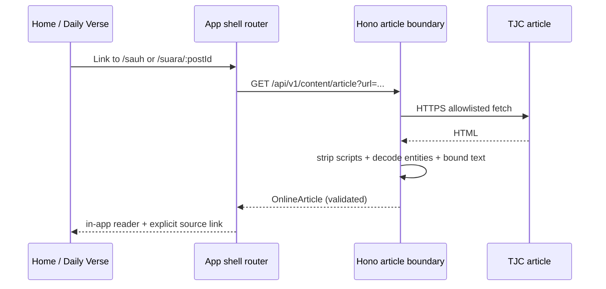

## Module responsibilities

| Area                    | Responsibility                                                                                                                                                                    |
| ----------------------- | --------------------------------------------------------------------------------------------------------------------------------------------------------------------------------- |
| `apps/web/src`          | Route-level UI, responsive shell, browser adapters, global search, media surface, asset lifecycle, literature resume, and feature controllers.                                    |
| `packages/contracts`    | Zod schemas and TypeScript types shared by the web, BFF, and tests.                                                                                                               |
| `packages/domain`       | Search, Bible, chord, MIDI, media, cache, and platform-independent repository behavior.                                                                                           |
| `apps/bff`              | Origin/CORS/CSRF/rate-limit boundary, upstream validation, PDF/canonical music range proxies, typed Edge speech audio proxy, cache headers, typed errors, and e-GYS cookie proxy. |
| `apps/native/src-tauri` | Tauri shell boundary and platform command registration; provider authentication belongs in a secure system-browser/native SDK.                                                    |
| `scripts`               | Deterministic upstream/asset generation, local sync, provenance, and release checks.                                                                                              |
| `docs`                  | Discovery evidence, ADRs, integration contracts, test/release evidence, and runbooks.                                                                                             |

## Data and persistence flow

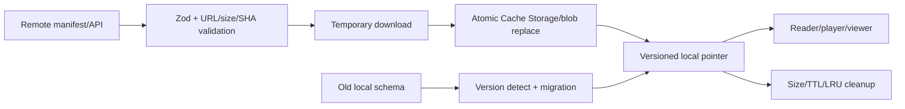

Critical user state is intentionally small and versioned: activity, favorites,
literature locations, preferences, diagnostics, and backup metadata. A migration must preserve
valid records, validate the result, and invalidate only the affected domain
when a record cannot be recovered.

## Asset lifecycle

Music and local pack assets use immutable source commits and SHA-256 records in
the generated asset manifest. Literature
cover URLs come from the TJC WordPress source where available; the generated
snapshot currently contains 279 verified cover mappings and explicit fallback
records for 18 entries whose source does not expose a cover. The service worker
caches TJC media only after an image request succeeds, and the PDF/MIDI/chord
loaders verify bytes before activating a cache entry. PDF literature is fetched
through `/api/v1/content/pdf` when a BFF is configured; the proxy allowlists
only `https://tjc.org/*.pdf` and preserves HTTP range requests for PDF.js.

The browser pack manager can check a configured `VITE_ASSET_MANIFEST_URL` (or
the immutable Pages manifest when no override is present). It parses the
versioned manifest, rejects duplicate IDs and untrusted origins, diffs content
identity rather than generated timestamps, stages only changed local assets,
validates every size/SHA-256 before the Cache Storage pointer changes, and
persists the active manifest. Removed local entries are cleaned after the new
pointer is active; a failed stage therefore leaves the previous pack usable.

Literature records keep a versioned page/scroll location. The catalog renders a
deduplicated “Terakhir dilihat” shelf and validates a saved page against the
current resource version before offering resume.

The PWA service worker keeps its install path small and deterministic. Cache
`gysapp-shell-v10` precaches the shell plus the compact offline indexes; after
the first client is ready, the client sends `gys-cache-optional` to warm the
TimGM soundfont and local MIDI/FluidSynth worker in the background. Optional
warming is skipped when the browser advertises Save-Data or a 2G connection,
and each optional asset is cached independently so one missing binary cannot
invalidate the shell.

The Bible reader uses the generated TB pack as a single source of truth. The
browser strips the pack's layout markers before display, while a lazy module
worker builds and queries the normalized 31,172-verse index off the main thread.
Worker startup is bounded and falls back to the same typed repository when a
worker is unavailable; stale requests are cancelled so a slow query cannot
overwrite a newer one. Split columns, bookmarks, highlights, notes, and query
history live in versioned local keys and remain available offline. The split
controller owns ratio clamping, pointer lifecycle, keyboard-safe persistence,
and the mobile guard independently of the reader component.

The global media surface subscribes to the external MIDI and speech stores,
not React render ticks. It exposes the active source as an internal route (and
verse hash for Bible speech), keeps title/progress visible in minimized mode,
clamps a persisted drag position after viewport changes, and registers Media
Session handlers against live refs so position updates do not recreate the
handler set.

Kidung subscribes only to the MIDI settings store (tempo/transpose/instrument),
not the 4 Hz playback-position store. This keeps the reader shell stable while
the floating surface updates its progress indicator.

The Kidung catalog builds a normalized search index once per loaded catalog
revision. Queries use token/prefix AND matching and preserve quoted phrases;
the UI never lower-cases the full lyric corpus on every keystroke. The vertical
PDF reader uses the same bounded-resource principle: pages outside the
IntersectionObserver preload window cancel their render task and release their
canvas. BFF Literature and Suara Sejati cache boundaries share in-flight
upstream requests, so concurrent shell mounts cannot create duplicate fetches.

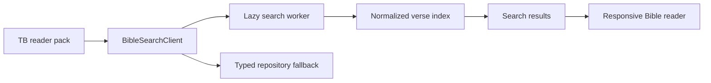

Kidung detail is one viewer with two presentation modes: Lyrics and PDF. Chord
is a capability layered on either presentation, so it is never a third route or
an independent viewer. The selected presentation and chord visibility are
persisted per hymn in separate versioned, bounded preference keys. A verified
note-aligned v2 document is loaded once; its PDF text model is cached by
`hymnId:resourceHash`, then reused for both the Text chord-line association and
the DOM marker layer above PDF.js canvases. Transpose and accidental changes
only update marker labels and do not rerender the PDF.

The reader also stores bounded typography preferences per hymn. The PDF layout
preference supports single, two-page, vertical, and horizontal scrolling; the
effective layout downgrades a two-page spread to one page below 720 px so a
phone never receives two unreadable canvases. The global MIDI session keeps the
same transpose and exposes source-program playback or each of the 128 General
MIDI programs; render-cache keys include tempo, transpose, instrument, source
hash, soundfont, and sample rate.

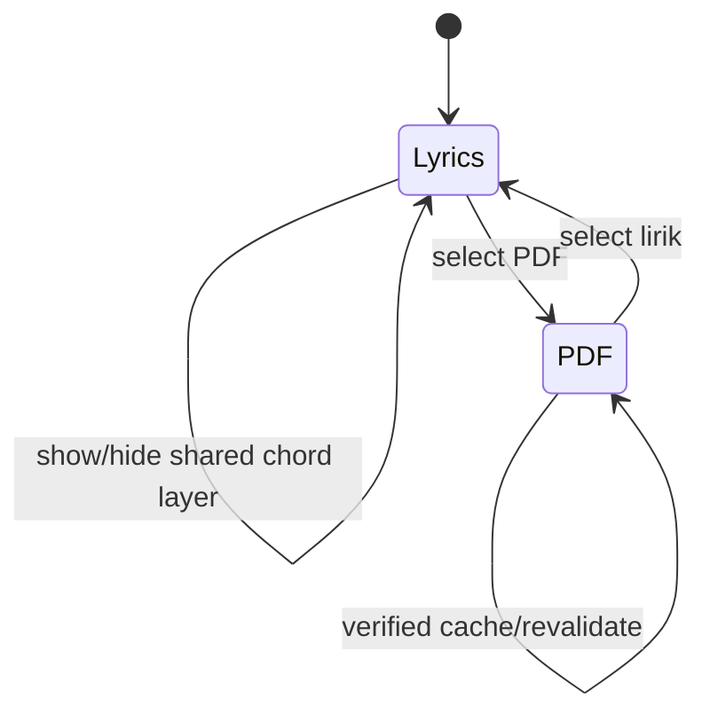

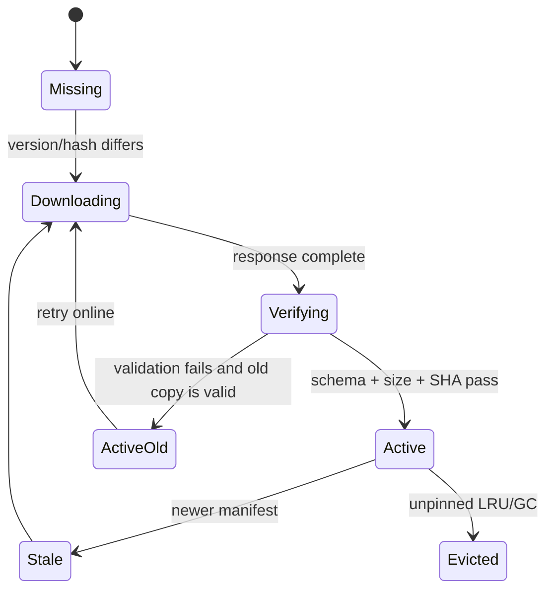

## Feature lifecycle diagrams

The diagrams below are the short operational map for the main user journeys.
They describe the boundaries that must remain stable when a route or platform
adapter is changed.

### Persistent media

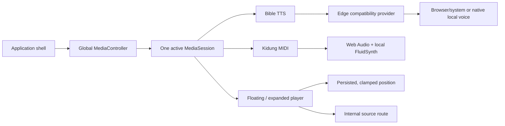

Only the controller owns handoff: starting one audible session pauses the
other, and the surface subscribes to a small external snapshot so playback
ticks do not rerender the application shell.

### Literature and PDF

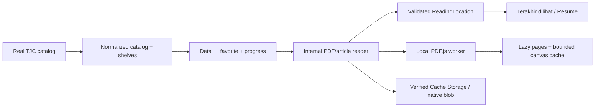

Saved locations are keyed by resource version. A changed resource clamps or
discards an invalid location instead of silently jumping to an unrelated page.

### Kidung

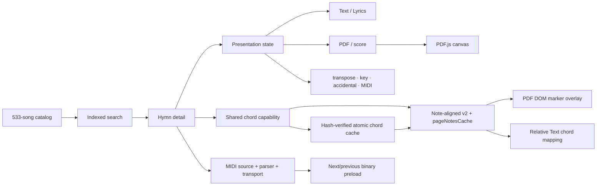

The mode switch unmounts the inactive presentation; raw and parsed assets are
shared by source hash so simultaneous opens do not create duplicate downloads.
The same marker layer is hidden or shown without re-decoding the PDF.

### Alkitab and voice

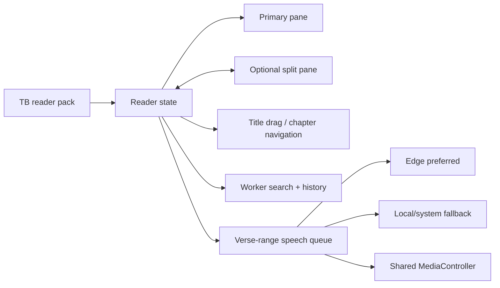

### e-GYS authentication and local contract sync

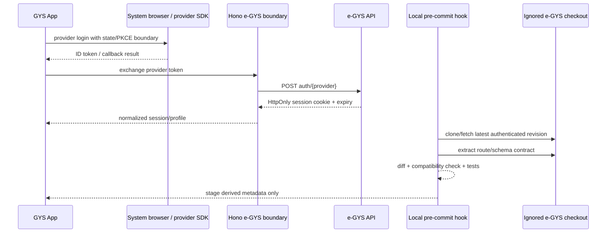

### Web cache, packaged assets, and release workflow

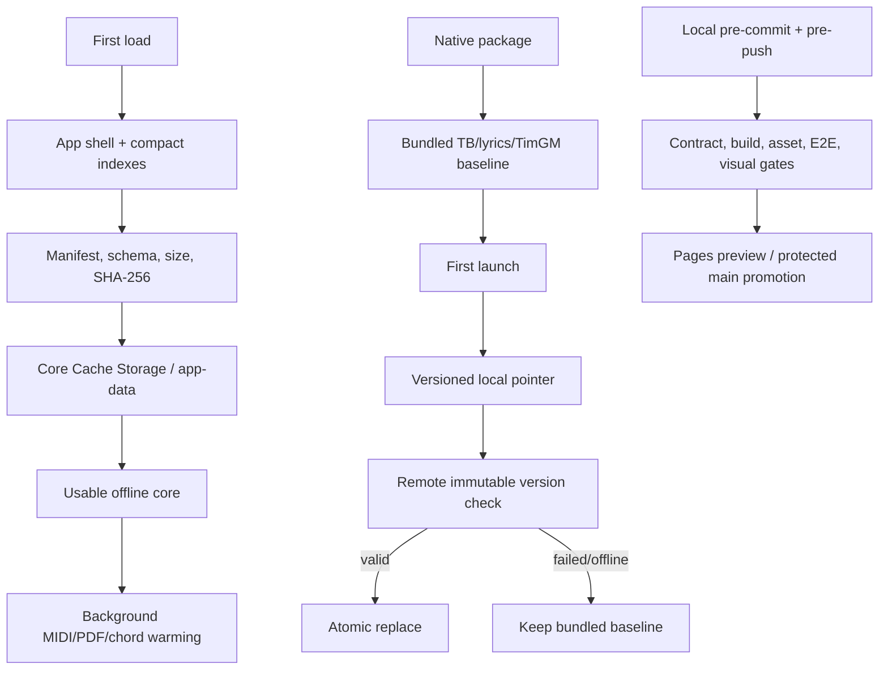

## Release gates

Local `pnpm verify:prepush` runs the same primary gates used by CI: e-GYS
revision/contract verification, formatting, lint, strict typecheck, unit and
contract tests, production builds, bundle budget, and Playwright critical
flows. It also runs `verify:native-assets` after the web build, which checks
the Tauri `frontendDist` boundary and every default offline/runtime binary.
Only the local hooks access the private e-GYS upstream; GitHub Actions is a
secondary verification layer for the already-reviewed generated contract and
never clones or fetches the upstream repository.

## Native platform boundary

Tauri exposes the shared `PlatformServices` key-value/blob boundary through
typed invoke commands. Records and verified media blobs are written under the
OS app-data directory with hex-encoded keys and unique temporary files before
atomic replacement; malformed base64 or corrupt JSON is rejected at the
boundary. The browser adapter remains the PWA fallback, while Tauri webviews
select the native adapter through the global invoke bridge. External URL
handoff is restricted to `http`/`https` and uses the allowlisted shell opener;
the in-app PDF/chord/document readers never use this path.

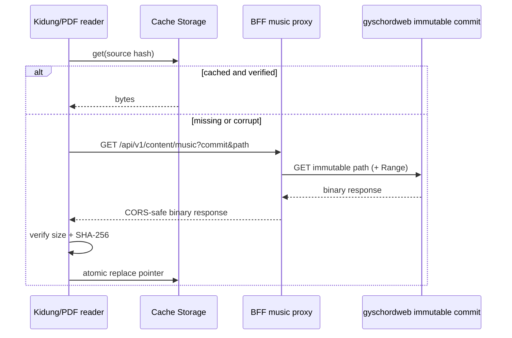
