# GYSApp architecture

Reviewed 2026-10-07. Runtime uses clean-room contracts/domain ports and generated
assets rather than source checkout imports. Current application behavior is
summarized in the [user guide](user-guide.md); source/benchmark receipts retain
their original dates.

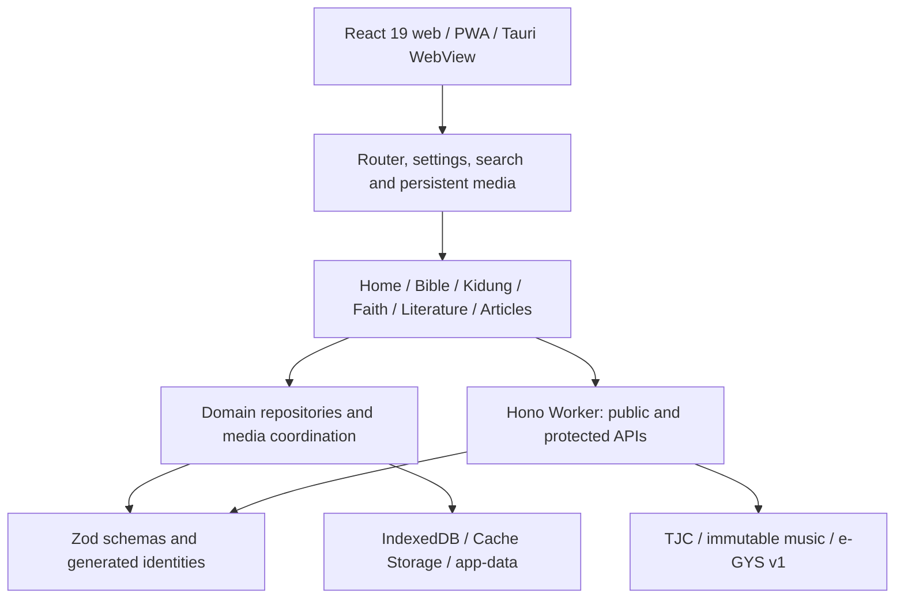
```mermaid
flowchart TB
  UI[React 19 web / PWA / Tauri WebView]
  SHELL[Router, settings, search and persistent media]
  FEATURE[Home / Bible / Kidung / Faith / Literature / Articles]
  DOMAIN[Domain repositories and media coordination]
  CONTRACT[Zod schemas and generated identities]
  STORE[IndexedDB / Cache Storage / app-data]
  BFF[Hono Worker: public and protected APIs]
  UPSTREAM[TJC / immutable music / e-GYS v1]
  UI --> SHELL --> FEATURE
  FEATURE --> DOMAIN --> CONTRACT
  DOMAIN --> STORE
  FEATURE --> BFF --> CONTRACT
  BFF --> UPSTREAM
```

## Module responsibilities

| Owner                                       | Responsibility                                                                                                   |
| ------------------------------------------- | ---------------------------------------------------------------------------------------------------------------- |
| `apps/web/src/App.tsx`, route/shell modules | Persistent shell, responsive navigation, locale/theme, error recovery and lazy route composition.                |
| Feature modules                             | Rendering and feature state; defer binary/worker work until requested.                                           |
| `packages/contracts`                        | Schemas, generated locks, publisher URL extraction and security/transport shapes.                                |
| `packages/domain`                           | Platform-independent search/cache/chord/media/backup behavior and ports.                                         |
| `apps/bff/src/index.ts`                     | Origin/CSRF/rate boundary, typed errors, upstream validation, range/proxy transport, provider cookies and relay. |
| `apps/native/src-tauri`                     | Narrow app-data/keyring/dialog/lifecycle/voice/login commands and origin-constrained shell.                      |
| `scripts`                                   | Reviewed generation, source provenance, deterministic hooks, package/build/test gates and profiling.             |

Public literature URL/parser helpers use the dedicated
`@gys/contracts/literature-source` export so optional source logic does not pull
unrelated contracts into startup. Build contracts before Wrangler resolves it.
Feature CSS/payloads follow the same lazy ownership where useful.

## Platform capability boundary

Browser/Tauri adapters implement the shared platform interfaces: key/value,
atomic blobs, database access, secret capability, notifications, dialogs/share,
external links, speech/deep links and lifecycle. Browser secret capability is
not persistent credential storage. Native secret failure is actionable and
never silently falls back to localStorage.

Native key/value/blob files live under versioned app-data roots, with path-safe
hex keys, payload bounds, unique temporary files and atomic replacement. Tauri
frontend capability grants remain narrow; raw keyring commands are not exposed
as generic frontend access. Native uses packaged assets and retires owned legacy
PWA registrations rather than installing the browser worker.

## Data and persistence flow

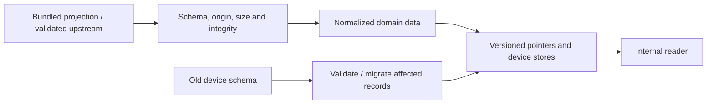
```mermaid
flowchart LR
  SOURCE[Bundled projection / validated upstream] --> CHECK[Schema, origin, size and integrity]
  CHECK --> MODEL[Normalized domain data]
  MODEL --> DEVICE[Versioned pointers and device stores]
  DEVICE --> VIEW[Internal reader]
  LEGACY[Old device schema] --> MIGRATE[Validate / migrate affected records] --> DEVICE
```

Activity, favorites, reading locations, annotations, preferences and backup
metadata are small/versioned. Cache identity uses actual immutable source/hash
or publication resource version, not fetch timestamps. Invalid records affect
only their domain; transient failures must not replace last-good data.

Public/private responses have separate ownership. Service-worker public caches
exclude account/provider responses. Browser opaque tokens stay HttpOnly; Tauri
bridge tokens stay in the OS keyring. Article text is sanitized/validated before
rendering; immersive selection suppression is not an authorization boundary.

## Asset lifecycle

Canonical music is pinned to
`gyschordweb@e8e7efe1189b5746a2bb542348e221844091c8d1`: 1,229 entries,
533 scores, 533 MIDI, 161 chords, two SoundFonts. Functional Fork data remains
`4f0d39b`; its KR master/ranges are a separate identity. Generated files, not
prose, own size/SHA/count evidence. TimGM and local synthesis runtime are
packaged; GeneralUser is an optional verified installation. Ten official
Indonesian Faith PDFs are local on-demand files with their own provenance map.

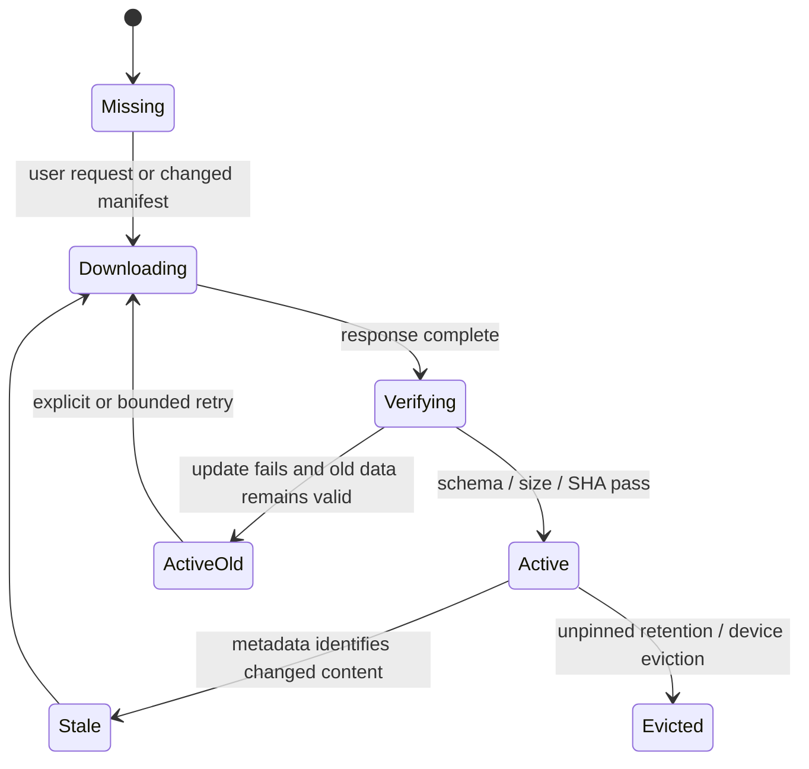
```mermaid
stateDiagram-v2
  [*] --> Missing
  Missing --> Downloading: user request or changed manifest
  Downloading --> Verifying: response complete
  Verifying --> Active: schema / size / SHA pass
  Verifying --> ActiveOld: update fails and old data remains valid
  Active --> Stale: metadata identifies changed content
  Stale --> Downloading
  Active --> Evicted: unpinned retention / device eviction
  ActiveOld --> Downloading: explicit or bounded retry
```

Offline pack updates stage changed assets, validate all identities, activate a
new pointer atomically, then remove retired content. Chord startup compares
pointer metadata without reading unchanged payloads. Reset aborts/disposes sync,
drains pending mutations/advisory writes, then clears owned storage. A late
startup task cannot repopulate cleared storage during reset.

## Feature lifecycle diagrams

### Startup and route preload

```mermaid
sequenceDiagram
  participant Boot as startup.js
  participant Shell as React shell
  participant Disk as Pack / snapshot caches
  participant Warm as Idle / link intent
  participant Route as Lazy route
  Boot->>Boot: Restore saved theme; church logo / progress
  Boot->>Shell: Mount stable shell
  Shell->>Disk: Reuse local metadata / editorial snapshot
  Shell->>Warm: Sequential optional warming after paint
  Warm->>Route: Shared module/data promise; bounded navigation wait
  Route->>Disk: Reuse verified data
  Note over Warm: Save-Data / slow connections suppress optional warm-up
```

Route rejection clears its preload promise for retry. Catalog metadata precedes
lyrics; Bible search precedes neither the chapter nor first paint. Score/reader
intent can prepare PDF.js; text-only/MIDI-off entry does not fetch neighboring
scores or prepare soundfont/PCM work.

### Kidung

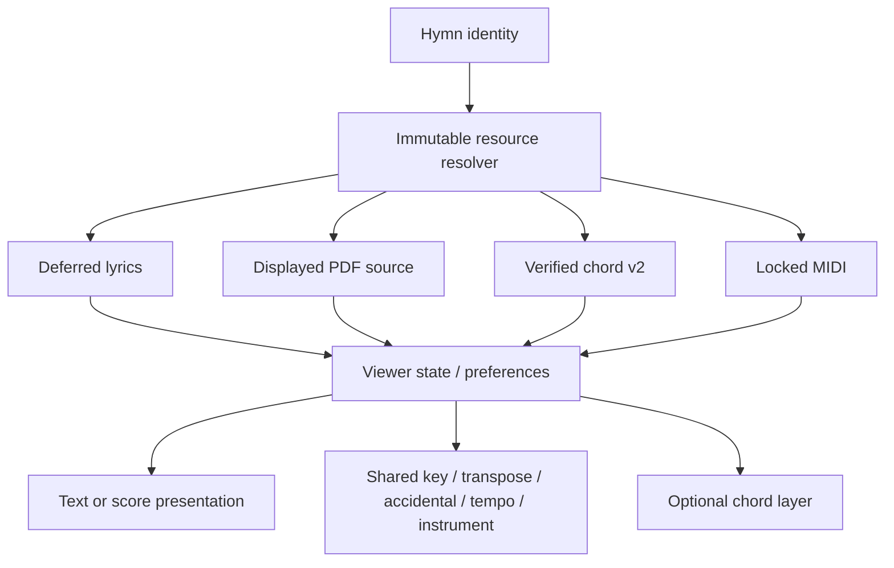
```mermaid
flowchart TB
  HYMN[Hymn identity] --> RESOLVE[Immutable resource resolver]
  RESOLVE --> LYRIC[Deferred lyrics]
  RESOLVE --> PDF[Displayed PDF source]
  RESOLVE --> CHORD[Verified chord v2]
  RESOLVE --> MIDI[Locked MIDI]
  LYRIC --> STATE[Viewer state / preferences]
  PDF --> STATE
  CHORD --> STATE
  MIDI --> STATE
  STATE --> MODE[Text or score presentation]
  STATE --> MUSIC[Shared key / transpose / accidental / tempo / instrument]
  STATE --> LAYER[Optional chord layer]
```

The catalog, playlist and settings are independent lazy sibling views with
consistent navigation. Text and score are distinct presentations; chord is a
capability, not a third mode. Text auto-fits the viewport/lines on first opening
and respects saved typography overrides. Long lyric/chord lines retain scrolling
instead of being clipped. Score exit returns to the list via its back action.

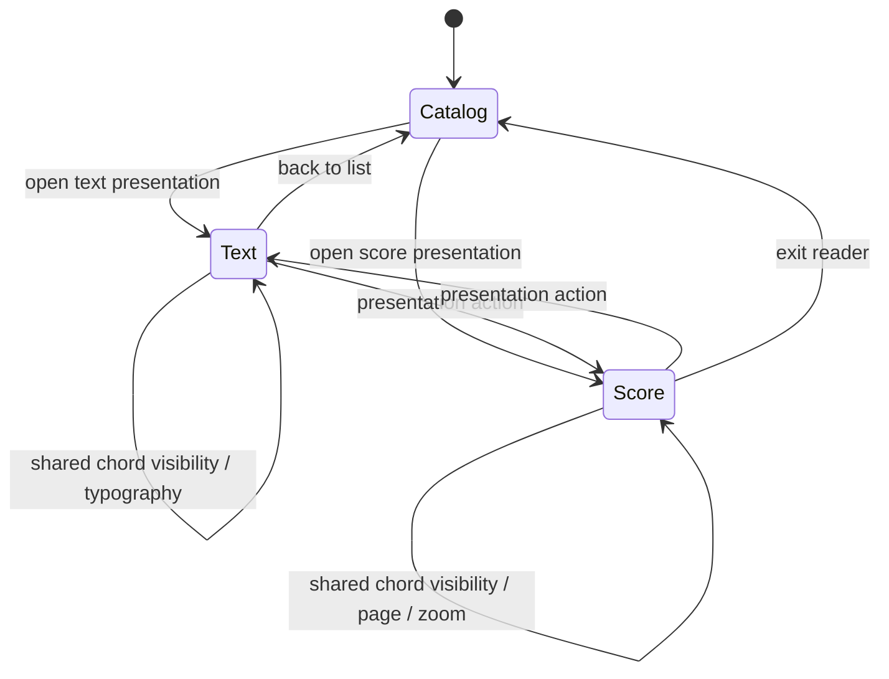
```mermaid
stateDiagram-v2
  [*] --> Catalog
  Catalog --> Text: open text presentation
  Catalog --> Score: open score presentation
  Text --> Score: presentation action
  Score --> Text: presentation action
  Text --> Text: shared chord visibility / typography
  Score --> Score: shared chord visibility / page / zoom
  Score --> Catalog: exit reader
  Text --> Catalog: back to list
```

### Chord source, key and geometry

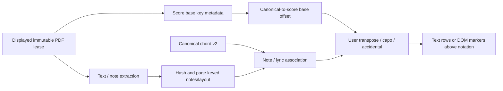
```mermaid
flowchart LR
  PDF[Displayed immutable PDF lease] --> TEXT[Text / note extraction]
  TEXT --> NOTES[Hash and page keyed notes/layout]
  PDF --> KEY[Score base key metadata]
  CHORD[Canonical chord v2] --> ASSOC[Note / lyric association]
  NOTES --> ASSOC
  KEY --> OFFSET[Canonical-to-score base offset]
  OFFSET --> LABEL[User transpose / capo / accidental]
  ASSOC --> LABEL
  LABEL --> OVERLAY[Text rows or DOM markers above notation]
```

Hymn 001 demonstrates the source-key distinction: canonical chords are C while
its score is Es. The base offset bridges that difference before user transpose;
key labels remain relative to the displayed score. Text/PDF share verified notes
and metadata; marker visibility/labels do not decode a second PDF or replace the
canvas. The strict source audit maps 3,738 entries without orphan/invalid geometry.

### Incremental cache and MIDI pipeline

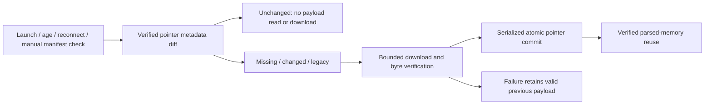
```mermaid
flowchart LR
  MANIFEST[Launch / age / reconnect / manual manifest check] --> DIFF[Verified pointer metadata diff]
  DIFF --> SAME[Unchanged: no payload read or download]
  DIFF --> CHANGED[Missing / changed / legacy]
  CHANGED --> VERIFY[Bounded download and byte verification]
  VERIFY --> POINTER[Serialized atomic pointer commit]
  POINTER --> READ[Verified parsed-memory reuse]
  VERIFY --> OLD[Failure retains valid previous payload]
```

Chord synchronization has a 60-second cooldown, one manifest in flight,
three-song startup concurrency, 25 MiB disk LRU/pin retention and a bounded
32-entry/1 MiB parsed cache. See [cache/preload](cache-and-preload.md).

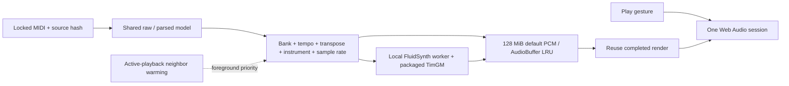
```mermaid
flowchart LR
  SOURCE[Locked MIDI + source hash] --> MODEL[Shared raw / parsed model]
  MODEL --> ID[Bank + tempo + transpose + instrument + sample rate]
  ID --> CACHE[128 MiB default PCM / AudioBuffer LRU]
  CACHE --> HIT[Reuse completed render]
  ID --> WORKER[Local FluidSynth worker + packaged TimGM]
  WORKER --> CACHE
  USER[Play gesture] --> AUDIO[One Web Audio session]
  HIT --> AUDIO
  NEIGHBOR[Active-playback neighbor warming] -. foreground priority .-> ID
```

Presence checks do not clone PCM. Cache owns either PCM or the playable buffer
for a key. Generation checks discard stale render/load results; preload respects
active settings and cancellation. Audio position/time fragments subscribe
separately from the settings/viewer. Oscillator fallback is explicitly labeled,
not represented as SoundFont parity.

### Persistent media

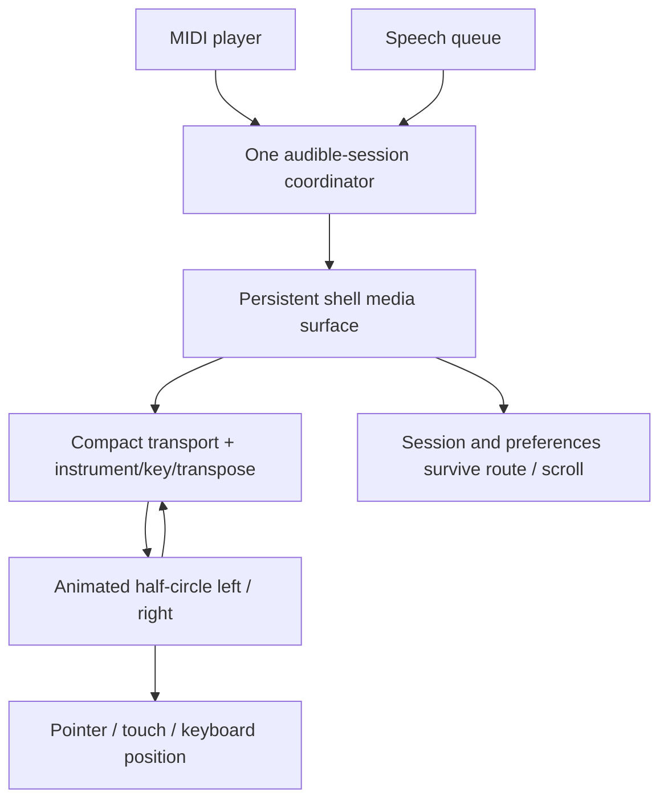
```mermaid
flowchart TB
  MIDI[MIDI player] --> COORD[One audible-session coordinator]
  TTS[Speech queue] --> COORD
  COORD --> GLOBAL[Persistent shell media surface]
  GLOBAL --> FULL[Compact transport + instrument/key/transpose]
  FULL --> EDGE[Animated half-circle left / right]
  EDGE --> FULL
  EDGE --> MOVE[Pointer / touch / keyboard position]
  GLOBAL --> ROUTE[Session and preferences survive route / scroll]
```

Starting MIDI pauses TTS; starting TTS pauses MIDI, without automatically
resuming the previous session. Expanded MIDI is two rows on tablet/desktop,
three on phone, maximum 900 px wide, with 36 px mouse/40 px touch controls.
Utilities remain in one bounded menu. Expanded height reserves reader space.

Minimize exposes one 28 px visible half-circle inside a 44 × 60 px hit area,
flush to either edge. A 6 px drag threshold distinguishes move from restore.
Touch taps restore on release even when a browser omits its compatibility click
after dragging; generated clicks cannot double-toggle. Keyboard arrows/Home/End
move the same control. Rectangle-based movement preserves glyph sizes, and
playing equalizer bars do not cause clock-driven React rerenders. TTS retains
its source-aware minimized context.

### Alkitab and voice

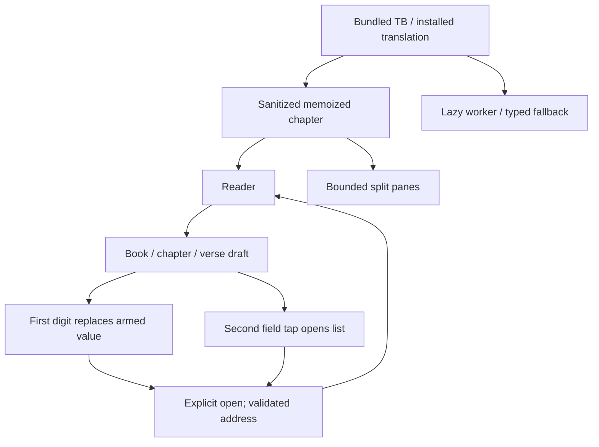
```mermaid
flowchart TB
  PACK[Bundled TB / installed translation] --> CHAPTER[Sanitized memoized chapter]
  CHAPTER --> SINGLE[Reader]
  CHAPTER --> SPLIT[Bounded split panes]
  PACK --> SEARCH[Lazy worker / typed fallback]
  SINGLE --> PICKER[Book / chapter / verse draft]
  PICKER --> KEYPAD[First digit replaces armed value]
  PICKER --> DROPDOWN[Second field tap opens list]
  KEYPAD --> APPLY[Explicit open; validated address]
  DROPDOWN --> APPLY
  APPLY --> SINGLE
```

The 66-book/31,172-verse TB projection is shared between reading and search.
The worker is created on actual search, bounds startup and cancels stale queries;
main-thread fallback is lazy. Chapter/verse limits come from active translation
data. The picker retains focus/inert modal ownership; cancel discards its draft.
Annotations/history and split geometry persist locally. Text is justified and
fills adaptive reading fields with smooth bounded scale/preferences.

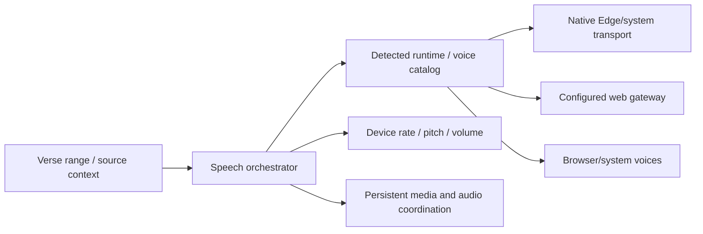
```mermaid
flowchart LR
  VERSE[Verse range / source context] --> QUEUE[Speech orchestrator]
  QUEUE --> CAP[Detected runtime / voice catalog]
  CAP --> NATIVE[Native Edge/system transport]
  CAP --> GATE[Configured web gateway]
  CAP --> SYSTEM[Browser/system voices]
  QUEUE --> PREF[Device rate / pitch / volume]
  QUEUE --> PLAYER[Persistent media and audio coordination]
```

Browser direct Edge does not invent compatibility headers. Native transport,
optional gateway and local system voices are separate capabilities. An unavailable
provider remains an explicit fallback/error, not a false successful speech state.

### Literature and PDF

```mermaid
sequenceDiagram
  participant UI as Literature reader
  participant Link as Validated link cache
  participant BFF as Public content Worker
  participant TJC as WordPress / TJC S3
  participant PDF as Shared PDF.js lease
  UI->>Link: Resolve issue's official PDF
  Link->>BFF: pdf-source metadata when missing/stale
  BFF->>TJC: Trusted bounded publisher lookup
  BFF-->>Link: Validated PDF URL
  UI->>PDF: Stable reader / shared source lease
  PDF->>BFF: PDF Range request
  BFF->>TJC: Forward range to allowlisted source/mirror
  TJC-->>PDF: Streamed bytes, CORS-exposed range headers
  PDF-->>UI: Completed first page / saved location
```

The link cache holds 64 validated URLs for 24 hours. Official literature PDFs
use the configured or public fallback Worker, including trusted S3, even if
optional login configuration is absent. Proxy signature/type checks reject
HTML errors; streams preserve range and Last-Modified. A stale hosted Worker
needs its own deployment. The catalog's 300-item projection, favorites and
versioned reading locations are independent of full publication bytes.

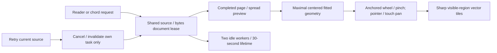
```mermaid
flowchart LR
  REQUEST[Reader or chord request] --> LEASE[Shared source / bytes document lease]
  LEASE --> PREVIEW[Completed page / spread preview]
  PREVIEW --> FIT[Maximal centered fitted geometry]
  FIT --> GESTURE[Anchored wheel / pinch; pointer / touch pan]
  GESTURE --> DETAIL[Sharp visible-region vector tiles]
  LEASE --> IDLE[Two idle workers / 30-second lifetime]
  RETRY[Retry current source] --> RELEASE[Cancel / invalidate own task only]
  RELEASE --> LEASE
```

Faith, Literature and Kidung share that viewer. Zoom spans 100–800% of fitted
size; spreads paint together, and page changes crossfade completed content.
Preview geometry remains continuous during zoom/resize; detail never paints
over the wrong page. Virtualized page canvases/operator lists and idle workers
are released. Multi-page hymns retain distinct page and song actions.

### Articles, thumbnails and Faith

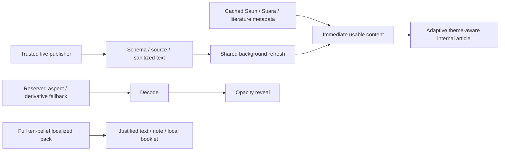
```mermaid
flowchart LR
  SNAP[Cached Sauh / Suara / literature metadata] --> FIRST[Immediate usable content]
  LIVE[Trusted live publisher] --> VALIDATE[Schema / source / sanitized text]
  VALIDATE --> REFRESH[Shared background refresh]
  REFRESH --> FIRST
  IMAGE[Reserved aspect / derivative fallback] --> DECODE[Decode] --> FADE[Opacity reveal]
  FIRST --> ARTICLE[Adaptive theme-aware internal article]
  FAITH[Full ten-belief localized pack] --> BELIEF[Justified text / note / local booklet]
```

Sauh selection follows the Jakarta day/publisher slug; fallback does not invent
current-day content. Article layouts support readable dark themes and adaptive
columns. Image geometry is fixed before download/decode. Faith search and full
texts fill their field; official local PDFs avoid remote booklet CORS failure.

### e-GYS authentication and local contract sync

```mermaid
sequenceDiagram
  participant User
  participant UI as Web provider row
  participant BFF
  participant WhatsApp
  participant V1 as Official e-GYS v1
  User->>UI: Click WhatsApp; reserve messaging tab
  UI->>BFF: Start; bind reference HttpOnly cookie
  BFF->>V1: whatsapp-login-request
  BFF-->>UI: Bot phone + prepared message/reference
  UI->>WhatsApp: Navigate prepared send link
  UI->>BFF: Reference-bound tracking WebSocket
  BFF->>V1: Origin-compatible official socket relay
  User->>WhatsApp: Send message
  V1-->>UI: Internal code + sender phone + matching reference
  UI->>BFF: Confirm automatically; no OTP entry
  BFF->>V1: whatsapp-login-confirm
  BFF-->>UI: HttpOnly session / ok; refresh profile
```

A trailing 120-second countdown replaces a login overlay. Retry cancels/replaces
the prior attempt; transient socket loss reconnects the same reference within
its deadline. Confirmation uses the sender phone, never the bot's start phone.
Google uses GIS, Apple its official popup SDK and random-state check; browser
tokens are not returned to JavaScript. Provider windows are expected handoffs.

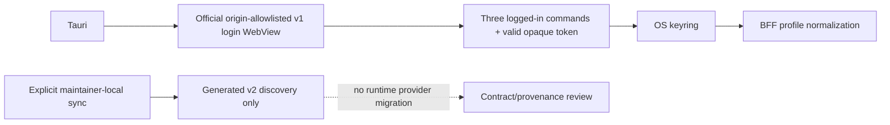
```mermaid
flowchart LR
  APP[Tauri] --> LOGIN[Official origin-allowlisted v1 login WebView]
  LOGIN --> BRIDGE[Three logged-in commands + valid opaque token]
  BRIDGE --> KEYRING[OS keyring]
  KEYRING --> BFF[BFF profile normalization]
  SYNC[Explicit maintainer-local sync] --> V2[Generated v2 discovery only]
  V2 -. no runtime provider migration .-> AUDIT[Contract/provenance review]
```

Local sync is explicit/authenticated, not a commit-hook fetch or CI private clone.
See [e-GYS integration](egys-integration.md) for routes/cookies/configuration.
Real-account/native origin acceptance is separate from mocked regressions.

### Web cache, packaged assets, and release workflow

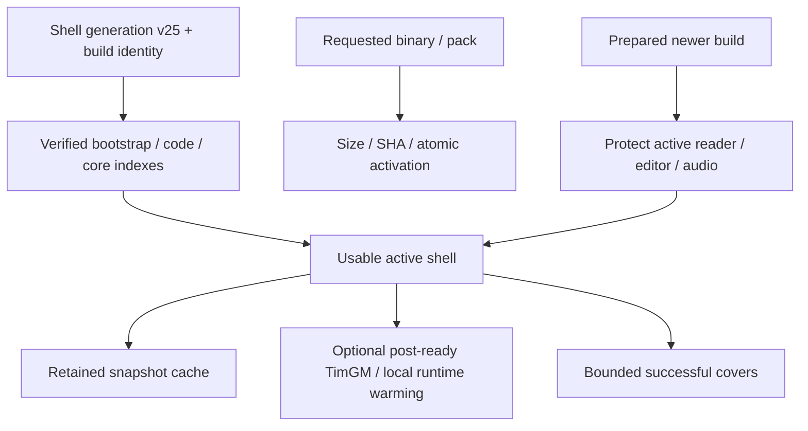
```mermaid
flowchart TB
  SW[Shell generation v25 + build identity] --> CORE[Verified bootstrap / code / core indexes]
  CORE --> ACTIVE[Usable active shell]
  ACTIVE --> EDITORIAL[Retained snapshot cache]
  ACTIVE --> WARM[Optional post-ready TimGM / local runtime warming]
  ACTIVE --> MEDIA[Bounded successful covers]
  USER[Requested binary / pack] --> VERIFY[Size / SHA / atomic activation]
  UPDATE[Prepared newer build] --> PROTECT[Protect active reader / editor / audio] --> ACTIVE
```

Public/private caches remain separated. Save-Data/slow connections suppress
optional warming. Native packages ship required data/audio/logo assets, checked
by `verify:native-assets`; packaged files and runtime storage are different.

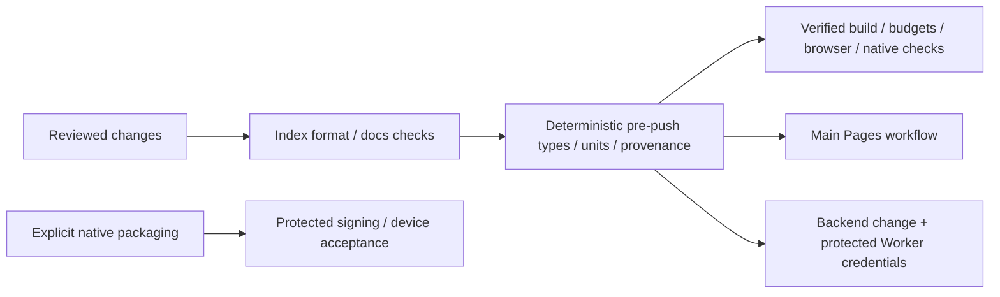
```mermaid
flowchart LR
  WORK[Reviewed changes] --> COMMIT[Index format / docs checks]
  COMMIT --> PUSH[Deterministic pre-push types / units / provenance]
  PUSH --> CI[Verified build / budgets / browser / native checks]
  PUSH --> PAGES[Main Pages workflow]
  PUSH --> WORKER[Backend change + protected Worker credentials]
  MANUAL[Explicit native packaging] --> SIGN[Protected signing / device acceptance]
```

## Release gates

Ordinary pre-push runs deterministic formatting/docs/provenance/types/units.
Full `verify:release` adds explicit local source sync/revision checks, strict
chord audit, native validation, build/assets/budgets and full browser tests.
HMR tests are local-only; resource/performance gates use production artifacts.
Do not rebuild while a browser suite loads emitted chunks.

Main pushes trigger CI/Pages and relevant Worker deployment. Missing protected
Worker credentials produce an explicit skip, not deployed backend success.
Remote SHA, hosted workflows, real providers, signed installation/device runs
and canonical hardware performance each require their own receipt. The current
Preview/Beta scope does not imply GA.

## UI and maintenance ownership

Church-blue tokens, icon-based grouped controls, adaptive width and compact
reader frames are current. `menu-motion.css`, `control-motion.ts`, retained
presence and view-transition modules each own one motion layer. Reduced motion
is immediate; nested Escape/focus/hit testing remain functional while closing.
Legacy lyric entrance is suppressed when a snapshot owns the transition.

See [UI system](ui-system.md), [cache/preload](cache-and-preload.md),
[operations](operations.md), [testing](testing-and-maintenance.md) and the
[current codebase map](maintenance/codebase-map.md). ADRs preserve accepted
boundaries; historical dated documents do not override current guide behavior.
