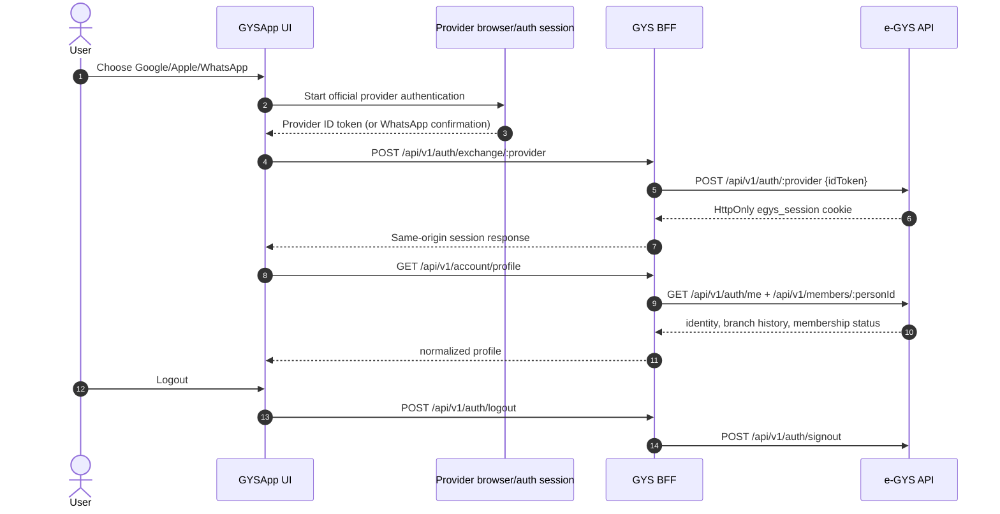
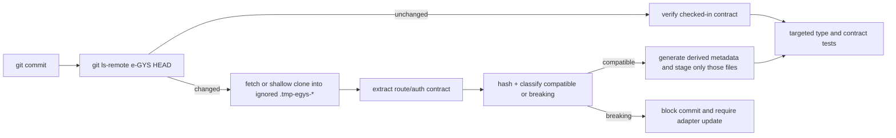

# e-GYS account integration

GYSApp never sends an e-GYS token directly to the browser storage. The web client calls the versioned GYS BFF routes and the Worker forwards the request to e-GYS with the upstream `egys_session` cookie (the upstream default; deployments may override the name).

## Verified upstream authentication boundary

The verified e-GYS revision in
[`docs/discovery/egys-upstream.json`](./discovery/egys-upstream.json) does not
expose an authorization-code callback route. Its actual public contract is
`GET /api/v1/auth/providers`, followed by `POST /api/v1/auth/{provider}` with a
provider-issued `{ idToken }`. The e-GYS server verifies that token and issues
an HttpOnly `egys_session` cookie; the browser never receives a session token in
the response body. Therefore GYSApp does not invent an OAuth callback or
bundle a client secret. Google/Apple's official browser or native SDK is the
authentication boundary, and the resulting ID token is exchanged through the
same BFF endpoint. WhatsApp uses the documented start/poll flow.

When a native provider SDK is available, the Tauri shell must use its secure
system-browser/auth-session implementation and hand only the resulting ID
token to the API client. It must not embed the e-GYS login page in a WebView.
The current web implementation loads the official provider SDK only after the
user explicitly chooses a provider; protected native client IDs and Worker
configuration remain deployment prerequisites.

## Runtime flow

1. The identity provider SDK obtains a short-lived Google or Apple `idToken` in the client.
2. The client posts `{ "idToken": "…" }` to `/api/v1/auth/exchange/google` or `/api/v1/auth/exchange/apple`.
3. The Worker forwards the token to e-GYS `/api/v1/auth/{provider}`, validates the typed `SignInResponse`, and rewrites the upstream `Set-Cookie` domain to the BFF origin.
4. `/api/v1/account/profile` and `/api/v1/auth/session` forward the HttpOnly cookie to e-GYS `/api/v1/auth/me`.
5. Logout forwards to `/api/v1/auth/signout` and clears the local cookie. The
   WhatsApp poll endpoint returns the same `SignInResponse` when it reaches
   `READY`; the BFF consumes that response, forwards its HttpOnly cookie, and
   exposes only `{ state: "READY" }` to the browser.

The upstream e-GYS repository is private and does not expose a public production base URL. Configure it only as a Cloudflare Worker secret:

```sh
wrangler secret put EGYS_API_BASE_URL --config apps/bff/wrangler.toml
```

The value must be the e-GYS backend origin (for example `https://egys.example.org`), without `/api/v1`. Google/Apple client IDs and redirect configuration remain protected identity-provider settings; no client secret is committed to this repository.

The optional Edge compatibility speech route follows the same boundary. Set a
vetted HTTPS gateway that accepts the typed JSON payload (`text`, `voice`,
`rate`, `pitch`, `volume`) and returns audio in `EDGE_TTS_URL`:

```sh
wrangler secret put EDGE_TTS_URL --config apps/bff/wrangler.toml
```

The browser uses `VITE_BFF_BASE_URL/api/v1/tts/edge` in `auto` mode and falls
back to a detected local voice when the binding is absent or unavailable.

When the secret is absent, the BFF returns a typed `UPSTREAM_UNAVAILABLE` response and the UI keeps the user in a safe signed-out state. This makes Pages preview builds deterministic while preserving the production integration boundary.

## Local upstream synchronization

The checked-in revision and route contract are maintained by
`scripts/sync-egys.mjs`. It first runs `git ls-remote` and compares the remote
`HEAD` with `docs/discovery/egys-upstream.json`; every run refreshes a matching
`.tmp-egys-*` checkout so a shallow checkout cannot silently drift. When the
revision moves, the script reuses that checkout (or creates a shallow filtered
checkout using the developer's existing Git credentials), extracts the versioned
controller route inventory, hashes it, and writes the deterministic generated metadata in
`apps/bff/src/egys-contract.ts`.

The route contract is intentionally a reviewable safety boundary, not runtime
code downloaded to a device. Removed method/path pairs are classified as
breaking. `--strict` exits non-zero so the local pre-commit hook blocks the
commit until the adapter and tests are updated. New routes are compatible by
default and still appear in the reviewed snapshot. Request/response schemas
remain owned by the upstream OpenAPI document and must be updated alongside
the adapter when a schema change is detected.

```sh
pnpm sync:egys                 # refresh the lock and generated route metadata
node scripts/sync-egys.mjs --strict --refresh  # force a local contract rebuild
```

`pnpm install` configures the repository-managed `.githooks` path. The
pre-commit hook performs strict e-GYS synchronization plus targeted contracts
and domain tests; the pre-push hook repeats synchronization and runs the full
format, type, test, build, bundle, and Playwright gates. Hooks never invoke
`git commit` recursively and never copy upstream source into this repository.

## Native API flow



The failure path is explicit: cancellation, provider denial, invalid token,
expired session, timeout, 401/403, malformed response, and upstream 5xx are
normalized into a visible retryable account state. Sensitive values are never
written to logs or localStorage.

## Local synchronization flow



The raw checkout is temporary input only. It is ignored, never copied into
the application bundle, and the pre-commit staged-file guard rejects any
`.tmp-egys-*` path.
